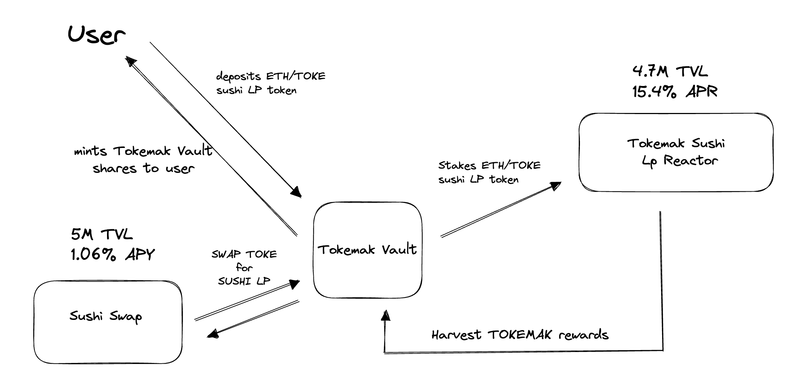

# xTokemak Erc4626 Tokenized Vault #
## Tokemak Reactors ##

[Tokemak](https://docs.tokemak.xyz/) is a novel protocol designed to generate deep, sustainable liquidity for DeFi and future tokenized applications that will arise throughout the growth and evolution of web3. 

---------------------------------------
## xTokemak Vault ##
**A Sushi/Tokemak Liquidity staking vault**

This is an ERC4626 vault implementation to tokenize the automation of compounding an initial deposit with Lp toke rewards from sushiswap and Tokemak rewards from its sushi lp reactor.

- The auto compound function of the xTokemakVault contract will claim the rewards available for the total assets staked into TOKE/ETH sushi pool.

- It will sell the tokamak in the sushi swap market for more of the Vault's underlying assets. And lastly, it will stake this Sushi lp token into the Tokamak pool for more Toke rewards.

- The rewards get harvested every 7 days and in the meantime, each investor holds a certain amount of shares equivalent to the amount provided to the vault initially.





##### ERC4626 Ecosystem Utilities

Router Implementation example from [Fei protocol](https://github.com/fei-protocol/ERC4626.git).

This repository contains open-source ERC4626 infrastructure that can be used by solidity developers using [EIP-4626](https://eips.ethereum.org/EIPS/eip-4626), including ERC4626Router (the canonical ERC-4626 multicall router) and xERC4626. Powered by [forge](https://github.com/gakonst/foundry/tree/master/forge) and [solmate](https://github.com/Rari-Capital/solmate).

- **Reactor Current stats:** $5.3M TVL | 16.6% APR
- **Reactor address**: [0x8858A739eA1dd3D80FE577EF4e0D03E88561FaA3](https://etherscan.io/address/0x8858A739eA1dd3D80FE577EF4e0D03E88561FaA3)
- **Reactor website:** Visit [tokemak](https://app.tokemak.xyz/) dashboard.

**Strategy Steps:**

- User provide liquidity in sushi swap to the weth/toke pool.
- User approves sushi lp token to vault and deposits.
- Vaults mints equivalent shares to user representing the position value at the time.
- Vault stakes LP token into TOKEMAK reactor.
- After 7 days reward cycle, TOKEMAK rewards contract will approve TOKE rewards to vault.
- Auto-compound function will claim rewards in the form of TOKE token and swap these for more underlying vault asset (sushi toke/weth lp).
- Auto-compound cycle repeats every 7 days to increment value of the shares.
- User will call public function to preview conversion of shares to vaults underlying token in order to monitor or redeem/withdraw.

**Install**


`````
forge build
`````

**Test**
  `````
  forge test
  `````

**Integration E2e test**

- require ethereum mainnet rpc node url variable at .env file
`````
RPC_MAINNET=<https://rpc.url.exaple>
